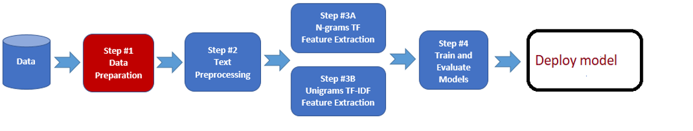

## Multi Class Text Classification Model 

___

#### Intoduction:

Southern States Toyotalift is a forklift dealership, but their goals go beyond finding ways to sell more forklifts to their customers. They are looking to be a “proactive business partner who helps identify ways your business can be more profitable, productive and gain a competitive advantage.” With this goal at the front of their mind, they reached out to our program at UCF with ideas for projects to push forward those goals.

As a capstone project for my master's in data analytics, I had a magnificent opportunity to work on project for Southern States Toyotalift where **I designed, preprocessed, trained, and evaluated Machine Learning model with Natural Language Processing (NLP) using Python on a real world data.**

#### Objective:

After communicating with client, I identified the main objective is to **create Machine learning model for the categorization of work order based on description** for the goal of optimizing maintenance worker's time, increasing productivity of manager by aiding his task, increasing profit with the better management, and lowering downtime of a forklift which leads to more money.

#### Data:

I had been given access to work order information on all types of vehicles that our customer (Southern States Tototalift) sells. The source of data was excel files. **The dimension of the data was 19495 X 31** in other words, I had 19495 work orders where each had 31 variables like order number, part used, type of vehicle, description, category etc.

&nbsp;&nbsp;&nbsp;&nbsp;&nbsp;&nbsp; *Note : Data is private so I am not able to publish.*

#### Model Design and Tools:

I used strategic approach to achieve the objective and followed the following steps in order,



1.  **Data Wrangling and Explanatory Analysis:** this step helps in understanding and preparing your data.

1.  **Data Preprocessing:** text data requires additional attention before we can start building model. This step helped us make our data ready for model creation and tuning.

1.  **Model Training:** in this step, I build  actual model.


1.  **Model Evaluation:** in this step, I tested the model with unseen data to evaluate the model. 

To execute above mentioned steps, I used the following python libraries,
 
| Pandas | Re | Numpy | Matplotlib | NLTK | sklearn |
|--------|----|-------|------------|------|---------|

___

#### Data Wrangling and Explanatory Analysis:

##### Data Wrangling

The Data was generic and lot of columns were redundant for example work order cost, worker name, and company name, so first I subset the columns that were important to the objectives which is;

Service Description – Description on work order service 
CAT – True category of work order **(Target Variable)**
WC – Work order number 
FLS GRP – Type of vehicle

Since main objective was only concerned with forklifts, I filtered the data to show only forklift’s data.


```Python
df_short = df[  ['Service Description', 'CAT', 'WC', 'FLS GRP']]
df_short = df_short[df_short['FLS GRP'] == 'FORKLIFTS']
```

**After subset and filtering, the dimension of data was 12397 X 4.**


The Service Description column consist of many variable which are manually entered as Key Value pair. Moreover, Key was not consistant across data due to manual data entry.

**To normalise the data, I created custom a function that will take "Service Description" column as input, extract the different data that matches pattern, and stored as a new column in dataframe.**

```Python
def Search_desc(X):
 if re.search("svc desc:|sdesc:", str(X) ) == None:
    startLoc = 0
    return ""
 else:
    startLoc = re.search("svc desc:|sdesc:", str(X) ).end()
 if re.search("complaint:|cause:|cure:|additional:" , str(X) ) == None:
    endLoc = len(X)
 else:
    endLoc = re.search("complaint:|cause:|cure:|additional:" , str(X) ).start()  
 return X[startLoc : endLoc]

 df_short['desc'] = df_short['Service Description'].apply(lambda x: Search_desc(x))
```

After extracting different variables out of "Service Description" column, I removed white space and carriage return charcters.

###### Explanatory Analysis

It is necessory that we check the the distribution of different category in classification problem. If data is not distributed uniformmly accros category then model will not learn category that has less data.

I created plots for distribution of work order categories to check the skewness of the data. In the distribution analysis, I observed that data is not well balanced, Preventive maintenance (PM), Repair and Damage were the most frequent type of work orders while Attachment (ATTACH), Request and Tires category had less data.


*When we encounter such problems, algorithms are often biased towards the majority class, not taking the data distribution into consideration. In the worst case, minority classes are treated as outliers and ignored. For some cases, such as fraud detection or cancer prediction, we would need to carefully configure our model or artificially balance the dataset, for example by undersampling or oversampling.*

In my objective, It was desirable to have a classifier that gives high prediction accuracy over the majority class, while maintaining reasonable accuracy for the minority classes. Therefore, I did not artificially balance the data.

#### Data Preprocessing:

To create model with text, we need to represent text into the formate that model can understand. I performed the following data processing task.

●	Tokenization — converted sentences to array of words

●	Removed unnecessary punctuation and white space

●	Converted to lowercase

●	Removed stop words — frequent words such as “the”,” is”, etc. that do not have specific semantic.
 
●	Stemming — words are reduced to a word stems (part of a word responsible for its lexical meaning) by algorithm. algorithm work by cutting off the end or the beginning of the word, considering a list of common prefixes and suffixes that can be found in a language.

●	Lemmatization — words are transformed to root words. For example, working, works, worked will be transformed to work so that model can handle the all form of the same word.

●	I converted category values to integer since model handles integer values better then string.

```Python
import nltk
from nltk.tokenize import word_tokenize#RegexpTokenizer
from nltk.stem import WordNetLemmatizer,PorterStemmer
from nltk.corpus import stopwords
nltk.download('stopwords')
nltk.download('wordnet')
nltk.download('punkt')

lemmatizer = WordNetLemmatizer()
stemmer = PorterStemmer() 

def preprocess(sentence):
    sentence=str(sentence)
    sentence = sentence.lower()
    cleantext = re.sub('[^A-Za-z\s]+', '', sentence)
    tokens = word_tokenize(cleantext)  
    filtered_words = [w for w in tokens  if not w  in stopwords.words('english')]
    stem_words=[stemmer.stem(w) for w in filtered_words]
    lemma_words=[lemmatizer.lemmatize(w) for w in stem_words]
    return " ".join(lemma_words)

df_short['Text_Paragraph']=df_short['Text_Paragraph'].map(lambda s:preprocess(s))
```

After preprocessing, I had lower case text description, which is free of any stop word, white space and all the words converted to root words. To create and train models we need to map text data to vectors. One of the effective techniques to numerically represent text is Bag of Words.

It would not be good approach if we treat all words same, there will be some words that gives more informaiton compare to others. For example, word “forklift” does not give any information about type of work order and possibly present in every work order description, while word “broken” clearly gives important information regarding work order type. So, I decided to weigh each word that shows how important this word is for classification.
 
I used TF-IDF (term frequency – inverse document frequency) to weight words in vectors. TF-IDF score is calculated the following way.

* Term Frequency (TF) = (Number of times word appears in a document)/(Number of word in the document)

* Inverse Document Frequency (IDF) = log(N/n), where, N is the number of documents (our case number of work order description) and n is the number of documents a word has appeared in. The IDF of a word that appears more in only one class and less in other is high, whereas the IDF of a word that is present in all categories is likely to be low. Thus, having the effect of highlighting words that are distinct.

* TF-IDF = TF * IDF

During TF-IDF vectorization, I also considered unigram and bigram pairs, as sometimes pairs of words make correct sense then single words. For example, “working” gives a sense of correctness while “Not Working” gives a sense of broken, malfunction.

```Python
from sklearn.feature_extraction.text import TfidfVectorizer
tfidf = TfidfVectorizer(sublinear_tf=True, min_df=5, norm='l2', encoding='latin-1', ngram_range=(1, 2), stop_words='english')
features = tfidf.fit_transform(df_short.Text_Paragraph).toarray()
labels = df_short.CAT_ID
```
#### Model Training and Evaluation:

I splited the data into training and testing dataset. I put 80% of work orders in training which will be used to train our model and 20% of work order to test the model.

I tried Naïve Bayes and the Random Forest algorithm, in this case Random Forest worked better. So, I decided to use a random forest algorithm as a final model and I implemented a model using the Sci-kit Learn library in python.

*it is best practice to try multiple model and select the one that gives better results for the data we have.*

```Python
# random forest model implementation
# this block is to split the dataset into training and testing set 
X = df_short['Text_Paragraph']
Y = df_short['CAT_ID']
X_train, X_test, y_train, y_test = train_test_split(X, Y, test_size=0.20 , random_state=42, stratify = Y )

# Create Data Pipeline for training
pipeline = Pipeline([('vect', tfidf),
                     ('chi',  SelectKBest(chi2, k=1000)),
                     ('clf', RandomForestClassifier())])

# Training the model and save it for later use
model = pipeline.fit(X_train, y_train)
with open('RandomForest.pickle', 'wb') as f:
    pickle.dump(model, f)
```
The graphic below shows the accuracy output of the random forest model on the test data. **We can see that the overall accuracy is 0.911.** Which means, giving the input, the model correctly classifies the class 91.1% of the time.

```Python
print(confusion_matrix(ytest, model.predict(X_test)))
print(classification_report(ytest, model.predict(X_test)))
print("accuracy score: " + str(model.score(X_test, y_test)))
```


___
